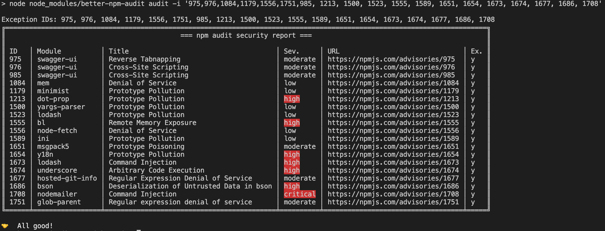
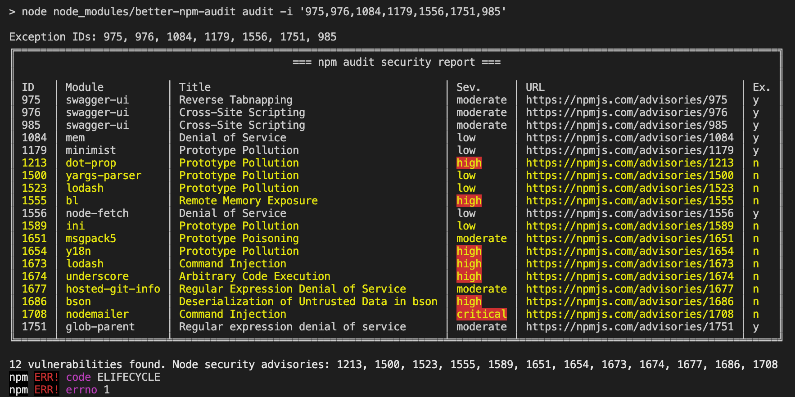
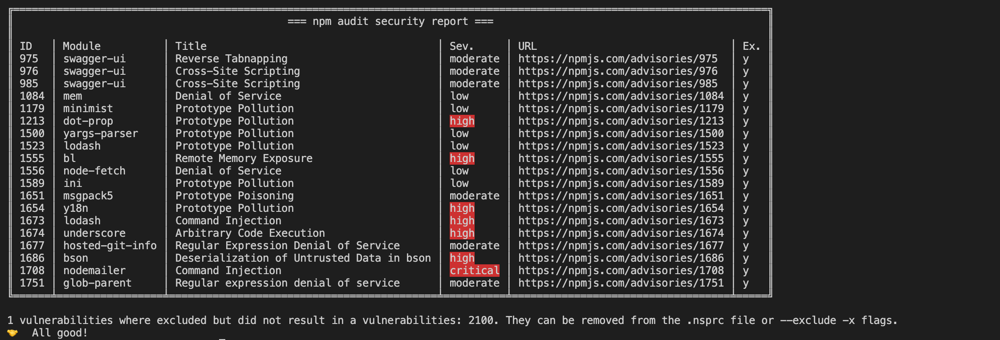
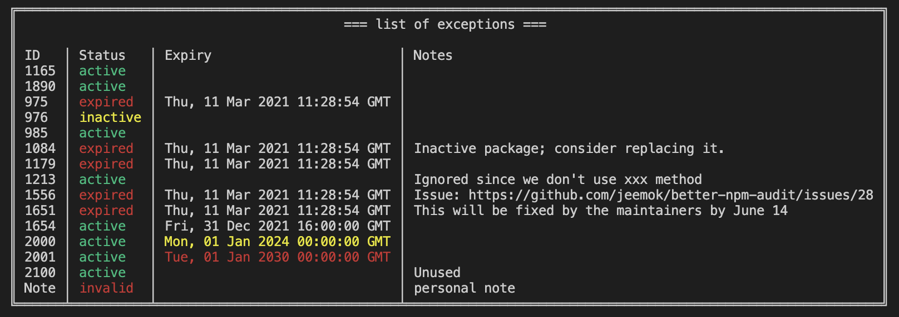

# Better NPM Audit

The goal of this project is to provide additional features on top of the existing npm audit options. We hope to encourage more people to do security audits for their projects.

[](https://npmjs.org/package/better-npm-audit)

    

## NPM version 6 and 7, and 8

NPM has upgraded to version 7 in late 2020 and has breaking changes on the `npm audit`. The output of npm audit has significantly changed both in the human-readable and `--json` output styles. Even more unfortunately, when NPM changed the JSON output in npm v7, they removed many of the other useful identifiers (`cves`, `cwe`, `github_advisory_id`) and the only thing left is the URL. We are trying our best to handle each version and provide consistent functionality to all of them. Related docs on v6 and v7 changes:

| Docs                       | Link                                                                                       |
| -------------------------- | ------------------------------------------------------------------------------------------ |
| NPM v6 & v7 changes        | https://github.blog/2020-10-13-presenting-v7-0-0-of-the-npm-cli/                           |
| NPM v7 blog post           | https://blog.npmjs.org/post/626173315965468672/npm-v7-series-beta-release-and-semver-major |
| Official NPM v6 audit docs | https://docs.npmjs.com/cli/v6/commands/npm-audit                                           |
| Official NPM v7 audit docs | https://docs.npmjs.com/cli/v7/commands/npm-audit                                           |
| Dealing with new npm audit | https://uko.codes/dealing-with-npm-v7-audit-changes                                        |

You may find the sample JSON outputs for each NPM versions in our codebase: [v6](https://github.com/jeemok/better-npm-audit/blob/master/test/__mocks__/v6-json-buffer.json), [v7](https://github.com/jeemok/better-npm-audit/blob/master/test/__mocks__/v7-json-buffer.json) & [v8](https://github.com/jeemok/better-npm-audit/blob/master/test/__mocks__/v8-json-buffer.json).

<br />

## Installation

    $ npm install --save better-npm-audit

or

    $ npm install -g better-npm-audit

<br />

## Usage

### Run global

```bash
better-npm-audit audit
```

### Run with exceptions



Unhandled or newly reported vulnerabilities will be highlighted:



Unused exceptions will be notified:



### Add into package scripts

```JSON
{
  "scripts": {
    "prepush": "npm run test && npm run audit",
    "audit": "better-npm-audit audit"
  }
}
```

Now you can run locally or in your CI pipeline:

```bash
npm run audit
```

<br />

## Options

| Flag              | Short | Description                                                                                           |
| ----------------- | ----- | ----------------------------------------------------------------------------------------------------- |
| `--exclude`       | `-x`  | Exceptions or the vulnerabilities ID(s) to exclude; the ID can be the numeric ID, CVE, CWE or GHSA ID |
| `--module-ignore` | `-m`  | Names of modules to exclude                                                                           |
| `--level`         | `-l`  | The minimum audit level to validate; Same as the original `--audit-level` flag                        |
| `--production`    | `-p`  | Skip checking the `devDependencies`                                                                   |
| `--registry`      | `-r`  | The npm registry url to use                                                                           |

<br />

## Environment Variables

| Variable                 | Description                                                                                                                |
| ------------------------ | -------------------------------------------------------------------------------------------------------------------------- |
| `NPM_CONFIG_AUDIT_LEVEL` | Used in setting the audit level. <br /> _Note: this will be disregard if the audit level flag is passed onto the command._ |

<br />

## Using `.nsprc` file to manage exceptions

You may add a file `.nsprc` to your project root directory to manage the exceptions. For example:

```json
{
  "1337": {
    "active": true,
    "notes": "Ignored since we don't use xxx method",
    "expiry": 1615462134681
  },
  "4501": {
    "active": false,
    "notes": "Ignored since we don't use xxx method"
  },
  "CWE-471": "CWE ID is acceptable",
  "GHSA-ww39-953v-wcq6": "GHSA ID is acceptable",
  "https://npmjs.com/advisories/1213": "Full or partial URL is acceptable too"
}
```

### Fields

| Attribute | Type             | Description                                               | Default | Examples                                                                                                                                                                                                                                                                                                                     |
| --------- | ---------------- | --------------------------------------------------------- | ------- | ---------------------------------------------------------------------------------------------------------------------------------------------------------------------------------------------------------------------------------------------------------------------------------------------------------------------------- |
| `active`  | Boolean          | If the tool should use it for exception                   | `true`  | `true`                                                                                                                                                                                                                                                                                                                       |
| `expiry`  | String \| Number | Human-readable date, or milliseconds since the UNIX Epoch |         | - `'2020-01-31'` <br> - `'2020/01/31'` <br> - `'01/31/2021, 11:03:58'` <br> - `'1 March 2016 15:00'` <br> - `'1 March 2016 3:00 pm'` <br> - `'2012-01-26T13:51:50.417-07:00'` <br> - `'Sun, 11 Jul 2021 03:03:13 GMT'` <br> - `'Thu Jan 26 2017 11:00:00 GMT+1100 (Australian Eastern Daylight Time)'` <br> - `327611110417` |
| `notes`   | String           | Notes related to the vulnerability.                       |         |

<br />

When using a `.nsprc` file, a report will be displayed when it starts running:



> Note: the expiry date will be styled in yellow and red color if it is detected more than one or five years ago.

<br />

## Changelog

You can find the changelog [here](https://github.com/jeemok/better-npm-audit/blob/master/CHANGELOG.md).

<br />

## Contributors

[Ian Wright](https://github.com/IPWright83), [Edwin Taylor](https://github.com/alertme-edwin), [Maarten Hus](https://github.com/MrHus), [Alex Burkowsky](https://github.com/alexburkowskypolysign), [David M. Lee](https://github.com/leedm777), [Kyle Clark](https://github.com/kyle-clark1824), [Guillermo Pincay](https://github.com/guillermaster), [Grzegorz Pawłowski](https://github.com/GrzesiekP), [CSLTech](https://github.com/CSLTech), [Paul Clarkin](https://github.com/paulclarkin), [mgdodge](https://github.com/mgdodge), [Ricky Sullivan](https://github.com/rickysullivan), [Sam Gregory](https://github.com/samgregory88), [Tristan WAGNER](https://github.com/tristanwagner), [Zak](https://github.com/ZedLove)

<br />

---

If you like this project,

<a href="https://www.buymeacoffee.com/jeemok" target="_blank"></a>
