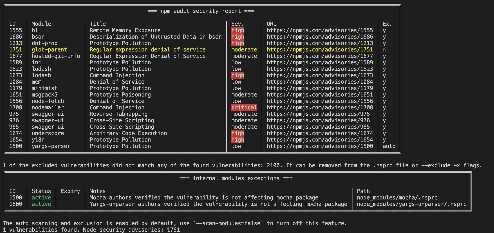
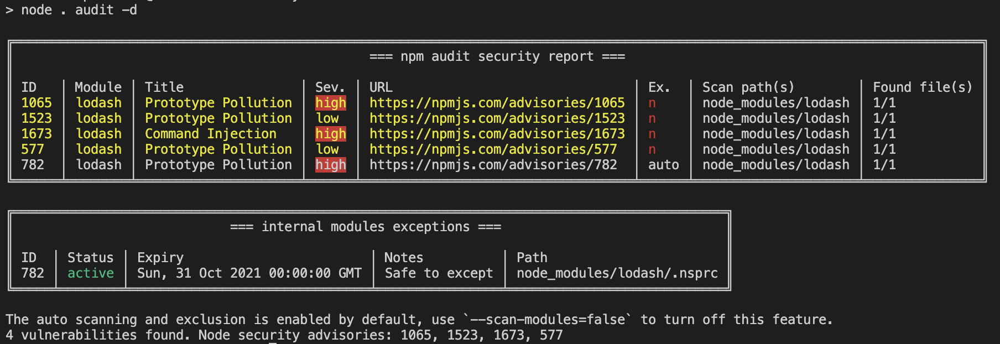

# Better NPM Audit

The goal of this project is to help to reshape npm audit into the way the community would like, by the community itself. Giving another option for everyone and encourage more people to do security audits.

[](https://npmjs.org/package/better-npm-audit)

    

## Supports both NPM version 6 and 7

NPM has upgraded to version 7 in late 2020 and has breaking changes on the `npm audit`. The output of npm audit has significantly changed both in the human-readable and `--json` output styles. We have added handling so it works properly in both npm versions.

| Docs                       | Link                                                                                       |
| -------------------------- | ------------------------------------------------------------------------------------------ |
| NPM v6 & v7 changes        | https://github.blog/2020-10-13-presenting-v7-0-0-of-the-npm-cli/                           |
| NPM v7 blog post           | https://blog.npmjs.org/post/626173315965468672/npm-v7-series-beta-release-and-semver-major |
| Official NPM v6 audit docs | https://docs.npmjs.com/cli/v6/commands/npm-audit                                           |
| Official NPM v7 audit docs | https://docs.npmjs.com/cli/v7/commands/npm-audit                                           |
| Dealing with new npm audit | https://uko.codes/dealing-with-npm-v7-audit-changes                                        |

<br />

## Installation

    $ npm install --save better-npm-audit

or

    $ npm install -g better-npm-audit

<br />

## Usage

### Run global

```bash
better-npm-audit audit
```

### Run with exceptions


Unhandled or newly reported vulnerabilities will be highlighted:


Unused exceptions will be notified:


### Add into package scripts

```JSON
{
  "scripts": {
    "prepush": "npm run test && npm run audit",
    "audit": "better-npm-audit audit"
  }
}
```

Now you can run locally or in your CI pipeline:

```bash
npm run audit
```

<br />

## Options

| Flag             | Short | Default | Description                                                                                       |
| ---------------- | ----- | ------- | ------------------------------------------------------------------------------------------------- |
| `--exclude`      | `-x`  |         | Exceptions or the vulnerabilities ID(s) to exclude                                                |
| `--level`        | `-l`  |         | The minimum audit level to validate; Same as the original `--audit-level` flag                    |
| `--production`   | `-p`  |         | Skip checking the `devDependencies`                                                               |
| `--registry`     | `-r`  |         | The npm registry url to use                                                                       |
| `--scan-modules` | `-s`  | `true`  | Scan through reported modules for `.nsprc` file. Note: this feature currently only support NPM v7 |
| `--debug`        | `-d`  |         | Debug mode                                                                                        |

<br />

## Environment Variables

| Variable                 | Description                                                                                                                |
| ------------------------ | -------------------------------------------------------------------------------------------------------------------------- |
| `NPM_CONFIG_AUDIT_LEVEL` | Used in setting the audit level. <br /> _Note: this will be disregard if the audit level flag is passed onto the command._ |

<br />

## Using `.nsprc` file to manage exceptions

You may add a file `.nsprc` to your project root directory to manage the exceptions. For example:

```json
{
  "1337": {
    "active": true,
    "notes": "Ignored since we don't use xxx method",
    "expiry": 1615462134681
  },
  "4501": {
    "active": false,
    "notes": "Ignored since we don't use xxx method"
  },
  "980": "Ignored since we don't use xxx method",
  "Note": "Any non number key will not be accepted"
}
```

### Fields

| Attribute | Type             | Description                                               | Default | Examples                                                                                                                                                                                                                                                                                                                     |
| --------- | ---------------- | --------------------------------------------------------- | ------- | ---------------------------------------------------------------------------------------------------------------------------------------------------------------------------------------------------------------------------------------------------------------------------------------------------------------------------- |
| `active`  | Boolean          | If the tool should use it for exception                   | `true`  | `true`                                                                                                                                                                                                                                                                                                                       |
| `expiry`  | String \| Number | Human-readable date, or milliseconds since the UNIX Epoch |         | - `'2020-01-31'` <br> - `'2020/01/31'` <br> - `'01/31/2021, 11:03:58'` <br> - `'1 March 2016 15:00'` <br> - `'1 March 2016 3:00 pm'` <br> - `'2012-01-26T13:51:50.417-07:00'` <br> - `'Sun, 11 Jul 2021 03:03:13 GMT'` <br> - `'Thu Jan 26 2017 11:00:00 GMT+1100 (Australian Eastern Daylight Time)'` <br> - `327611110417` |
| `notes`   | String           | Notes related to the vulnerability.                       |         |

<br />

When using a `.nsprc` file, a report will be displayed when it starts running:


> Note: the expiry date will be styled in yellow and red color if it is detected more than one or five years ago.

<br />

## Auto trust security model

If we trust a package author enough to install their package, then we also trust them to create an `.nsprc` file that covers all the (transitive) dependencies of that package, in the context of that package.

So if we are working on a project `A`, and we install a package `B` as a dependency, then we trust the author of `B` to decide whether `B` is affected by a vulnerability in its dependency `C`. I also trust the author of `B` to make decisions about the author of package `C`, so if `C` contains an `.nsprc` file with an exception about a vulnerability in its dependency, `D`, then we trust that exception because the author of `B` trusts it, and we trust him.

More generally, we can imagine a chain like this:

`A` -> `B` -> `C` -> `D` -> `E` -> `F`

where npm audit reports a vulnerability in `F`, but we are trusting the authors of `B`, `C`, `D`, and `E` to say whether that vulnerability is relevant in the context of their packages.

Extending the example above, then, if we have a tree like this:

```
A -> B -> C -> D -> E -> F
 |
  -> X -> Y -> Z -> F
```

then the author of package `A` (us), still needs to worry about a vulnerability in `F` due to the way it may be used by `X`, `Y`, and `Z`. Again, though, any of the authors of `X`, `Y`, or `Z` can include an `.nsprc` exception for the vulnerability in `F`, and we will trust their judgement (because we are installing `X`'s package, and he trusts `Y`'s code, etc.)

The auto excepted vulnerabilities will be labeled as "auto" in the report table:



You can turn this feature off by using the flag `--scan-modules=false`

Special shout out to [@EdwinTaylor](https://github.com/alertme-edwin) for his effort in making this possible.

> Note: This feature currently only support npm v7

### Debug mode

To inspect the module `.nsprc` file paths and details, use `--debug` flag to turn on debug mode:



<br />

## Changelog

You can find the changelog [here](https://github.com/jeemok/better-npm-audit/blob/master/CHANGELOG.md).

<br />

## Special mentions

- [@IanWright](https://github.com/IPWright83) for his solutions in improving the vulnerability validation for us to have the minimum-audit-level and production-mode flags.

- [@EdwinTaylor](https://github.com/alertme-edwin) for all the bug reports and improvement suggestions.

- [@MrHus](https://github.com/MrHus) for the logging of unused exceptions from the .nsprc file and -ignore flags. Courtesy of 42 BV.

<br />

---

If you like this project,

<a href="https://www.buymeacoffee.com/jeemok" target="_blank"></a>
